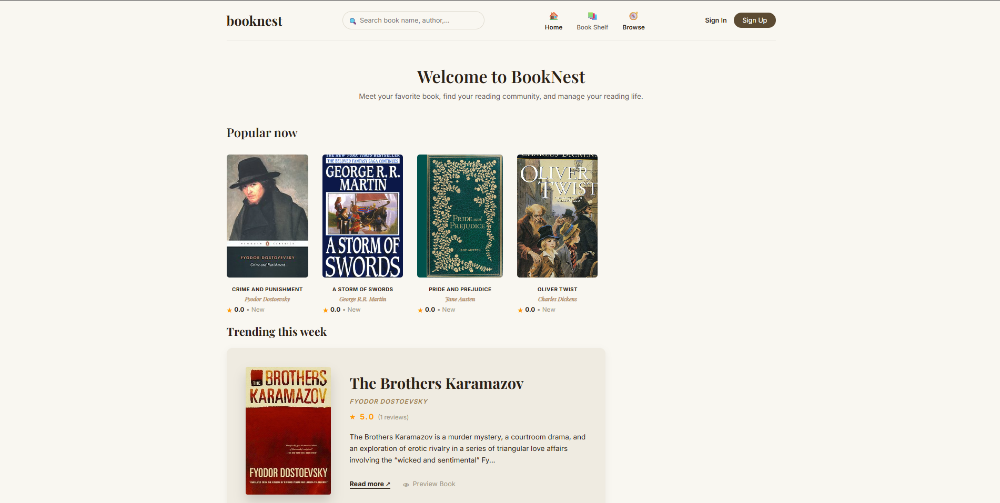
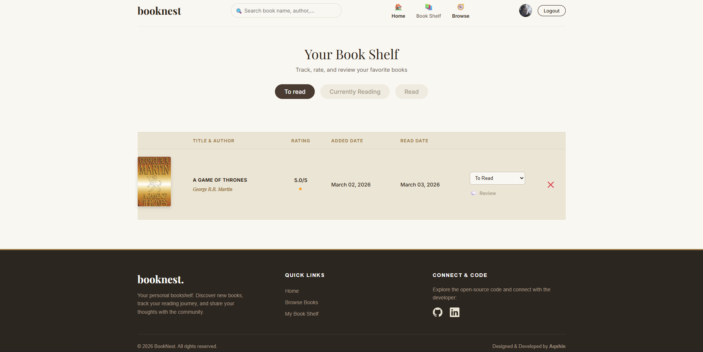
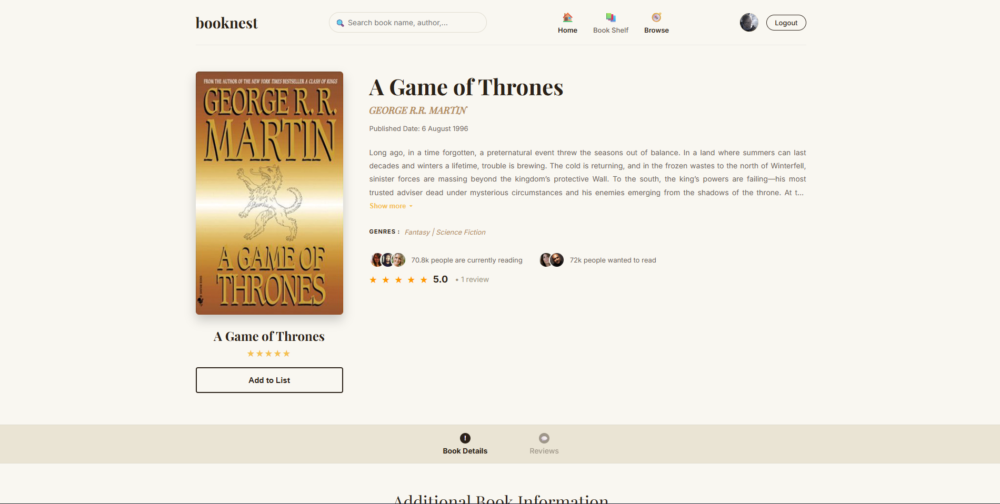
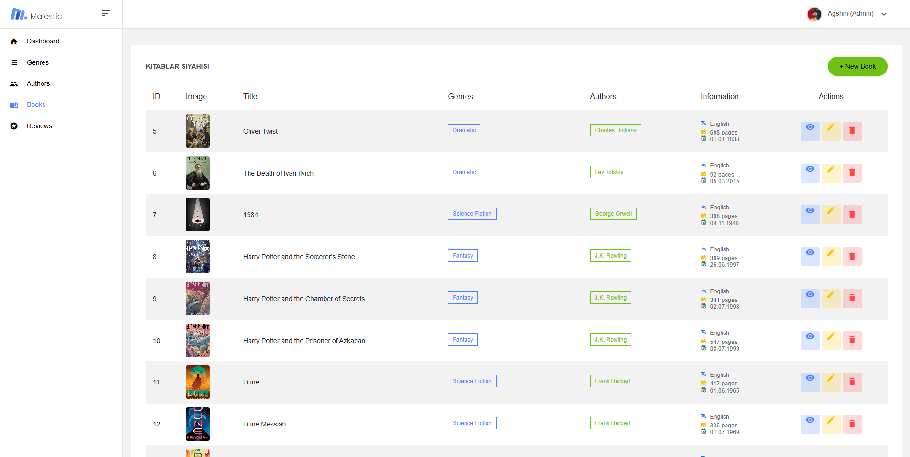

# 📚 BookNest - A Modern Book Review & Recommendation Platform

Welcome to **BookNest**, an elegant, full-stack web application designed for book enthusiasts. Inspired by platforms like Letterboxd, BookNest allows users to discover new reads, manage their personal bookshelves, and share reviews within a community-driven ecosystem.

## 🌐 Live Demo
The application is deployed and live.  
**Explore BookNest here:** http://aqshin-001-site1.anytempurl.com/

---

## ✨ Key Features

* **Dynamic Bookshelf Management:** Users can seamlessly add books to their personal shelves (`To Read`, `Currently Reading`, `Read`).
* **Smart Recommendation Engine:** Features a dynamically updated "Trending This Week" section based on real-time review counts and average ratings.
* **Role-Based Admin Dashboard:** A secure, dedicated panel for administrators to manage books, monitor community reviews, and control user roles.
* **Premium UI/UX:** A responsive, modern grid layout built with clean CSS, featuring smart text-truncation, auto-generated user/author avatars, and elegant Toastr.js notifications.
* **Custom Error Handling:** Strongly-typed, user-friendly 404 and 500 error pages to ensure a seamless navigation experience.

---

## 🛠️ Tech Stack & Architecture

Built with a robust **N-Tier Architecture** (Core, Data, MVC) to ensure separation of concerns, scalability, and clean code principles.

* **Backend:** C#, ASP.NET Core MVC (.NET 10)
* **Database:** Microsoft SQL Server & Entity Framework Core (Code-First)
* **Identity:** ASP.NET Core Identity for secure Authentication & Authorization
* **Frontend:** HTML5, CSS3, Flexbox/CSS Grid
* **Libraries:** Toastr.js, jQuery
* **Deployment:** SmarterASP.net

---

## 📸 Screenshots

| Home Page & Trending | User Bookshelf |
| :---: | :---: |
|  |  |

| Book Details & Reviews | Admin Dashboard |
| :---: | :---: |
|  |  |

---

## ⚙️ How to Run Locally

1. Clone this repository:
   ```bash
   git clone https://github.com/aqshinn/booknest.git
   
2. Navigate to the BookNest.MVC directory and update the appsettings.json with your local SQL Server connection string.

3. Open the Package Manager Console and apply database migrations to build your local schema:
   ```bash
   Update-Database

4. Run the application via Visual Studio or the .NET CLI:
   ```bash
   dotnet run
